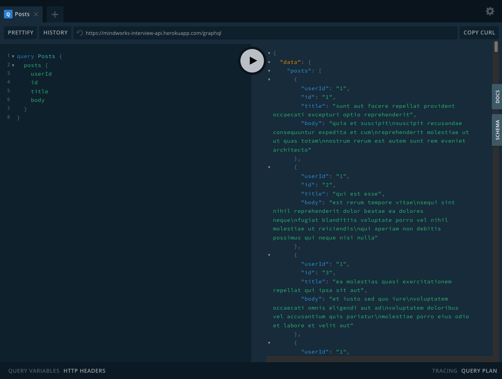
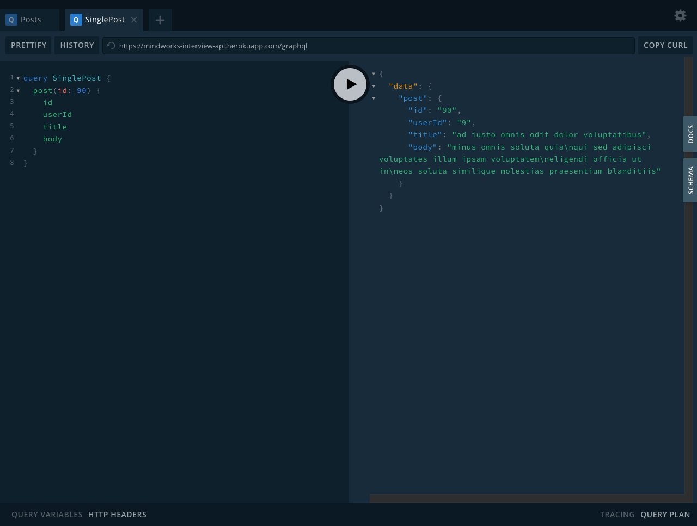
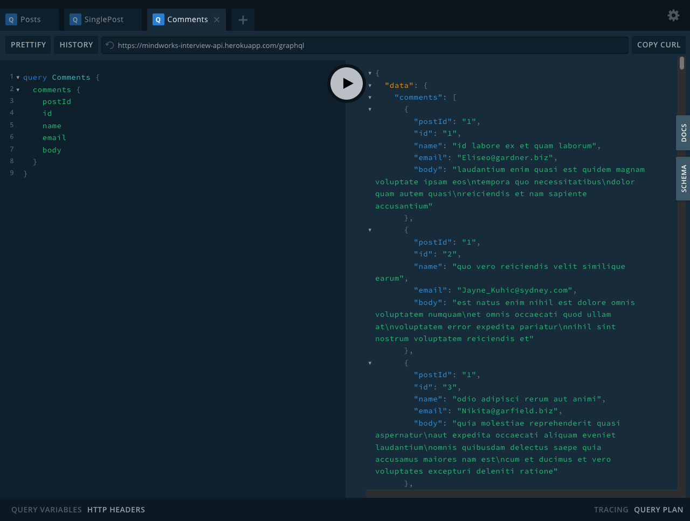

# Table of contents

- [Table of contents](#table-of-contents)
  - [Introduction](#introduction)
  - [Technologies](#technologies)
  - [API Response Screenshots](#api-response-screenshots)
  - [View the API](#view-the-api)
  - [Getting Started](#getting-started)
  - [Learn More](#learn-more)
  - [Deployment](#deployment)

## Introduction

This is part of a technical assessment I had gone through for a Frontend Developer position with Mindworks Interactive, a digital agency in Malaysia. This backend application was built with Express, Apollo Server and GraphQL. The dataset is provided by [{JSON} Placeholder](https://jsonplaceholder.typicode.com/).

## Technologies

- Express for the backend framework
- Apollo Server for the GraphQL server
- GraphQL as the query language for this API
- Heroku for the deployment platform

## API Response Screenshots

All posts


Single post


All comments


## View the API

You can make test queries in the [GraphQL Playground](https://mindworks-interview-api.herokuapp.com/graphql).

## Getting Started

First, run the development server:

```bash
npm run dev
```

Open [http://localhost:4000/graphql](http://localhost:4000/graphql) with your browser to see the GraphiQL GUI. Here, you can make test queries for posts, single post, and comments.

You can create more and update existing query types as well as work with resolver functions inside the `Schema` directory.

*Yarn configuration wasn't set, so you can customise your own to your liking.*

## Learn More

To learn more about Express, GraphQL or Apollo Server, you can start with these official resources:

- [Express.js Documentation](https://expressjs.com/) - learn about how to build backend applications with the Express framework.
- [GraphQL](https://graphql.org/) - a query language for your APIs
- [Apollo Server](https://www.apollographql.com/docs/apollo-server/getting-started/) - get started with Apollo Server

## Deployment

I deployed this repository with [Heroku](https://www.heroku.com/), but you can also deploy this on other platforms that support Node.js such as AWS, Azure, Digital Ocean, and Google Cloud.